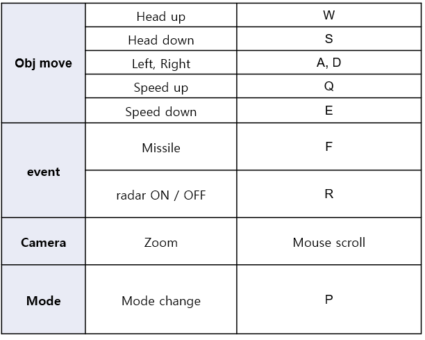

# Flight Simulator(openGL)

Inha Univ   
Infomatioin and communication engineering   
Computer Graphics(Park In Kyu)   
Mini project   

## Demo video(KOR) link
* [Youtube](https://www.youtube.com/watch?v=3a22c5xiA1s) - Demo video(KOR) link

## Main functioni
### assembling mode
* assemble blocks
* save file(.lego)
* load file(.lego)
### flight mode
* launch missile
* radar on/off(detect pot)

## Keyboard interface
### Assembling mode

### Flight mode

## Refer this setting   
you need to download freeglut.

